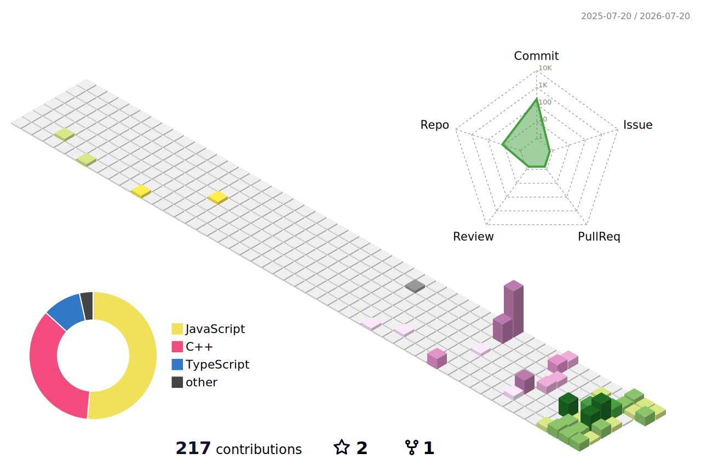

<p align="center">
  <a href="https://readme-typing-svg.demolab.com">
    
  </a>
</p>

<p align="center">
  
  <a href="https://github.com/suraj502?tab=repositories">
    
  </a>
  <a href="https://codolio.com/profile/suraj9258">
    
  </a>
  
</p>

<p align="center">
  <b>B.Tech IT @ MIET Meerut · Expected 2027 · IIT Roorkee ML & Web Dev Training</b>
</p>

---

## Contribution Playground

<p align="center">
  
</p>

<p align="center">
  <picture>
    <source media="(prefers-color-scheme: dark)" srcset="https://raw.githubusercontent.com/suraj502/suraj502/output/github-contribution-grid-snake-dark.svg" />
    <source media="(prefers-color-scheme: light)" srcset="https://raw.githubusercontent.com/suraj502/suraj502/output/github-contribution-grid-snake.svg" />
    
  </picture>
</p>

<p align="center">
  
</p>

---

## Workbench

<table>
  <tr>
    <td width="25%" valign="top">
      <h3>AI / LLM</h3>
      <p>Multi-LLM routing, RAG pipelines, prompt engineering, AI evaluation — wiring language models into real workflows.</p>
    </td>
    <td width="25%" valign="top">
      <h3>Full-Stack</h3>
      <p>React + Node + Express + MongoDB — from auth to deployment. REST APIs built to last under real traffic.</p>
    </td>
    <td width="25%" valign="top">
      <h3>DSA</h3>
      <p>200+ problems across arrays, graphs, DP, trees and more. Tracked live on Codolio — consistent, not cramming.</p>
    </td>
    <td width="25%" valign="top">
      <h3>Systems Thinking</h3>
      <p>Healthcare automation, candidate screening, video platforms — I build for impact, not just functionality.</p>
    </td>
  </tr>
</table>

<p align="center">
  
</p>

<p align="center">
  
  
  
  
  
  
</p>

---

## Field Notes

<p align="center">
  <a href="https://github.com/suraj502">
    
  </a>
  <a href="https://github.com/suraj502">
    
  </a>
</p>

<p align="center">
  <a href="https://github.com/suraj502">
    
  </a>
</p>

| Project | Signal | Impact |
|---|---|---|
| [RepoScore AI](https://github.com/suraj502) | `React` `Node` `MongoDB` `LLM` `Jest` | 98% LLM uptime · 100+ repos analysed · report in ~2s |
| [AuthClear AI](https://github.com/suraj502) | `Python` `RAG` `OCR` `Vector DB` | 14 days → 10 seconds · $4 → $0.05 per transaction |
| [StreamFlow](https://github.com/suraj502) | `React` `Node` `Express` `MongoDB` | Scalable video platform with auth, subs & recommendations |

---

## GitHub Stats

<p align="center">
  
  
</p>

<p align="center">
  
</p>

---

## Build Log

```text
GitHub repo + resume  ->  AI evaluation pipeline  ->  hire signal in 2s
handwritten Rx notes  ->  OCR + RAG engine        ->  auth decision in 10s
raw video upload      ->  streaming platform      ->  personalised feed
DSA problem           ->  pattern recognition     ->  optimal solution
```

## Timeline

```
2026  ──  BigCode Challenge Qualifier
          DSA + JavaScript under timed conditions

2025  ──  AuthClear AI @ Hackathon  (Team Nexus AI)
          Most impactful AI system built in 48 hours

2024  ──  IIT Roorkee — Web Dev & ML Program
          ML fundamentals · supervised learning · full-stack

2024  ──  ISTE Technical Member, MIET Meerut
          Organised contests · mentored juniors · built resources
```

<details>
  <summary>More about me</summary>
  <br />
  <p>
    
    
    
  </p>
  <p>I'm drawn to the gap between what AI can do in a demo and what it actually does in production. Every project I build tries to close that gap a little more.</p>
</details>

---

<p align="center">
  <a href="https://linkedin.com/in/suraj-singh-077105286">
    
  </a>
  &nbsp;
  <a href="mailto:singhsuraj16953@gmail.com">
    
  </a>
  &nbsp;
  <a href="https://codolio.com/profile/suraj9258">
    
  </a>
</p>
